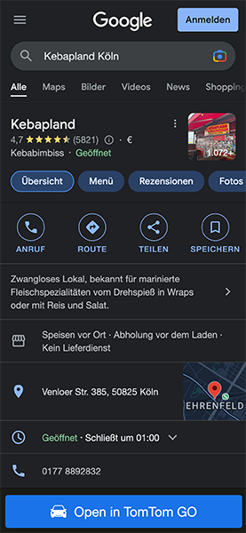
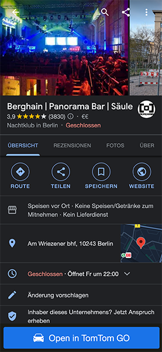

# Google Maps (on Google Search) to TomTom GO

## Description

 | 
:--------------------------------------:|:--------------------------------------:

This scripts adds a simple button at the bottom edge to open a place within google search results in TomTom GO. The script searchs for the coordinates of the searched place and links the button with TomTom GO's URL scheme `tomtomgo://x-callback-url/navigate?destination=` to open the app.

## How to use

Use any browsers addon on mobile that supports user scripts:

iOS:
- [Userscripts](https://apps.apple.com/us/app/userscripts/id1463298887)
- [StopTheMadness](https://apps.apple.com/us/app/stopthemadness/id1376402589?mt=12)

Android:
- [Tampermonkey](https://play.google.com/store/apps/details?id=net.biniok.tampermonkey)

Either click on the button below, after you have installed tampermonkey or copy and paste the contents of or save the file tomtomgo-button.user.js to the/your desired location.

## License

This work is licensed under GPL v3.
